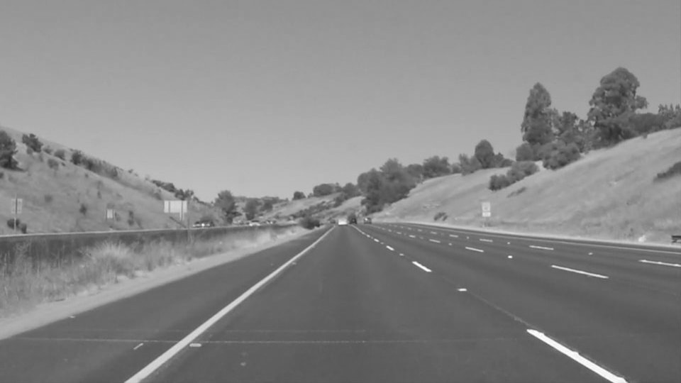
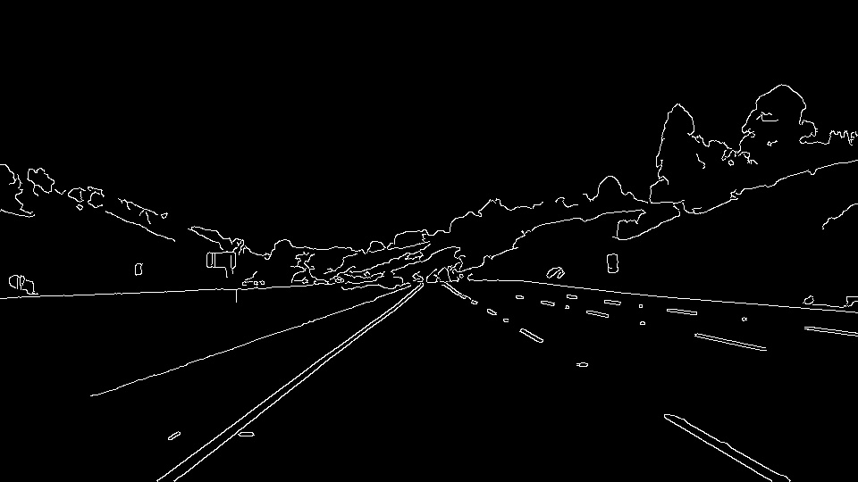
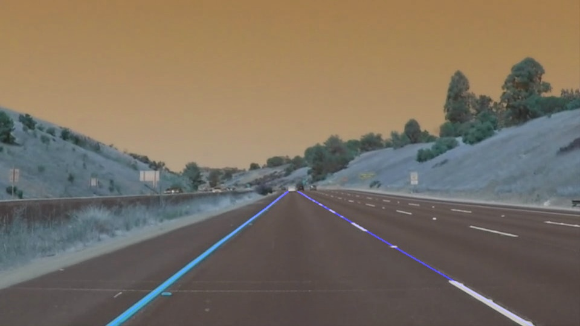

# **Finding Lane Lines on the Road** 

Overview
---

When we drive, we use our eyes to decide where to go.  The lines on the road that show us where the lanes are act as our constant reference for where to steer the vehicle.  Naturally, one of the first things we would like to do in developing a self-driving car is to automatically detect lane lines using an algorithm.

In this project you will detect lane lines in images using Python and OpenCV.  OpenCV means "Open-Source Computer Vision", which is a package that has many useful tools for analyzing images.  

---
## The goals / steps of this project are the following:

Make a pipeline that finds lane lines on the road

Reflect on your work in a written report

# **Reflection**
## 1. Description of pipeline:

###### My pipeline consisted of 5 steps as:

 1. Conversion of the images to grayscale.

 2. Applied Gaussian Blur with kernel size of 5 to smoothen the images.
 
 3. Used Canny Edge Detector to get edges information from the images.
 
 4. Cropped images to consider only lower half of the images.
 
 5. Used Hough Transform to detect lines

##### In order to draw a single line on the left and right lanes, I modified the draw_lines() function by following logic:

 - Separated left lane lines and right lane lines using slope of lines.

 - Got bottom most point of line and top most point of line for both left and right lane lines.

 - Using these points, drawn lane lines

Example images for various statges of pipeline:

1. grayscale_output.jpg

2. hough_lines_output.jpg

3. canny_output.jpg

4. final_output.jpg

## 2. Shortcomings with my current pipeline
One potential shortcoming would be what would happen when road would have more curves, as a result lane lines will look like curves, so plotting straight lane lines will not be a good idea.

Another shortcoming could be If there are more straight lines which are not lane lines, it will be difficult to find the actual lane lines.

## 3. Possible improvements to my pipeline
A possible improvement would be to not plot straight line using top most and bottom most points, instead plot by connecting end points of various straight lines of a single lane together.
